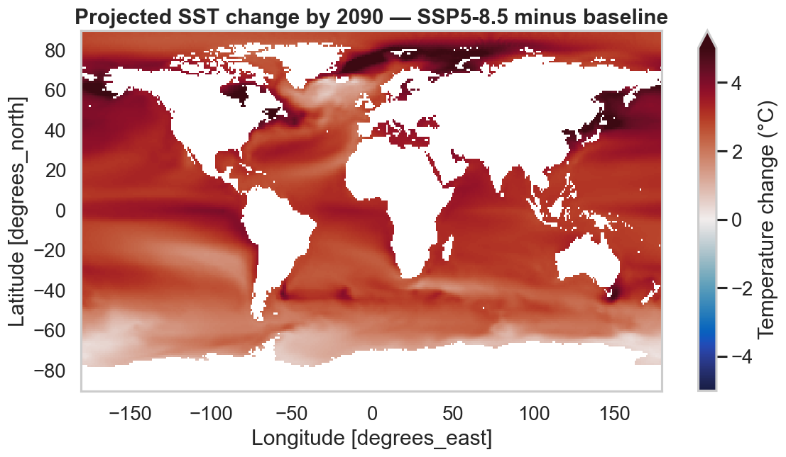
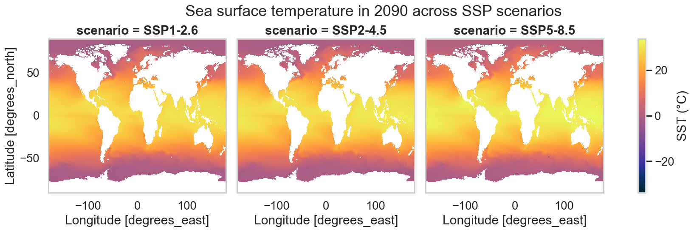
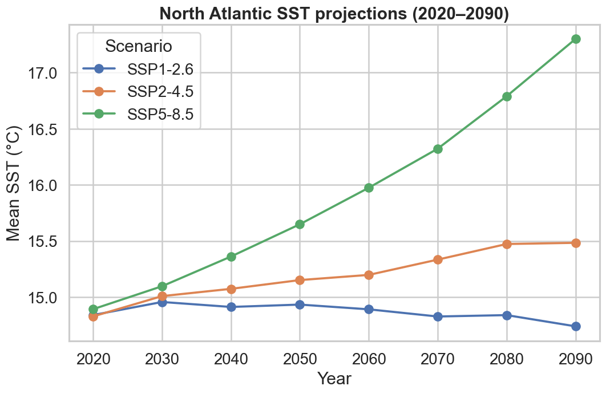

# Climate change

Bio-ORACLE ships both a **baseline** period and future projections under several
**SSP** scenarios, so climate-change figures are mostly array arithmetic. The
future layers carry decadal time steps from 2020 to 2090.

```bash
pip install "pyo-oracle[viz]"
```

A small helper loads any layer on a coarse global grid:

```python
import pyo_oracle as pyo

def load_global(ds_id, variables, step=20):
    constraints = pyo.build_constraints(
        ds_id,
        latitude=(-89.975, 89.975),
        longitude=(-179.975, 179.975),
        latitude_step=step,
        longitude_step=step,
    )
    return pyo.load_layer(ds_id, constraints=constraints, variables=variables, fmt="xarray")
```

## How much warmer? A delta map

Subtract the baseline from the 2090 high-emission (SSP5-8.5) layer and plot the
difference with a **diverging** colormap centred on zero.

```python
import cmocean

base = load_global("thetao_baseline_2000_2019_depthsurf", ["thetao_mean"])["thetao_mean"].isel(time=0)
future = load_global("thetao_ssp585_2020_2100_depthsurf", ["thetao_mean"])["thetao_mean"].isel(time=-1)  # 2090
delta = future - base

limit = float(abs(delta).quantile(0.99))
delta.plot(
    figsize=(11, 5.5),
    cmap=cmocean.cm.balance,
    vmin=-limit, vmax=limit,
    cbar_kwargs={"label": "Temperature change (°C)"},
)
```



## Compare scenarios side by side

Stack several scenarios along a new `scenario` dimension and let xarray's
`FacetGrid` draw one panel each.

```python
import pandas as pd
import xarray as xr

scenarios = {
    "SSP1-2.6": "thetao_ssp126_2020_2100_depthsurf",
    "SSP2-4.5": "thetao_ssp245_2020_2100_depthsurf",
    "SSP5-8.5": "thetao_ssp585_2020_2100_depthsurf",
}
layers = [load_global(dsid, ["thetao_mean"])["thetao_mean"].isel(time=-1) for dsid in scenarios.values()]
facet = xr.concat(layers, dim=pd.Index(list(scenarios), name="scenario"))

facet.plot(col="scenario", col_wrap=3, cmap=cmocean.cm.thermal, figsize=(15, 4.5))
```



## Projection trends through 2090

Take a regional mean at each decade and plot the trajectories. Here the North
Atlantic diverges sharply between low- and high-emission futures.

```python
import matplotlib.pyplot as plt

fig, ax = plt.subplots(figsize=(10, 6))
for label, dsid in scenarios.items():
    constraints = pyo.build_constraints(
        dsid,
        time=("2020-01-01T00:00:00Z", "2090-01-01T00:00:00Z"),
        latitude=(30, 60), longitude=(-60, 0),
        latitude_step=8, longitude_step=8,
    )
    da = pyo.load_layer(dsid, constraints=constraints, variables=["thetao_mean"], fmt="xarray")["thetao_mean"]
    series = da.mean(dim=["latitude", "longitude"])
    years = [int(str(t)[:4]) for t in series["time"].values]
    ax.plot(years, series.values, marker="o", label=label)
ax.set(xlabel="Year", ylabel="Mean SST (°C)")
ax.legend(title="Scenario")
```



!!! note "Simple vs. area-weighted means"
    These regional means weight every grid cell equally. For rigorous global or
    large-region averages, weight by `cos(latitude)` to account for shrinking
    cell area toward the poles.
