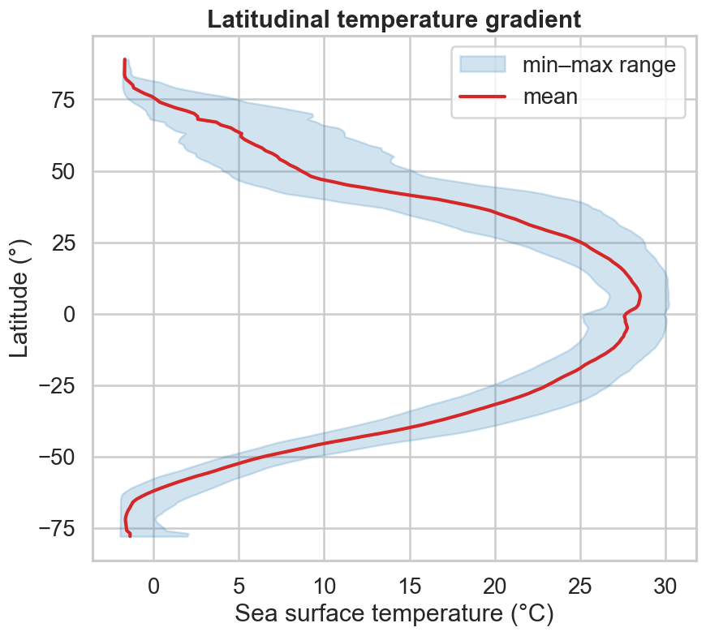
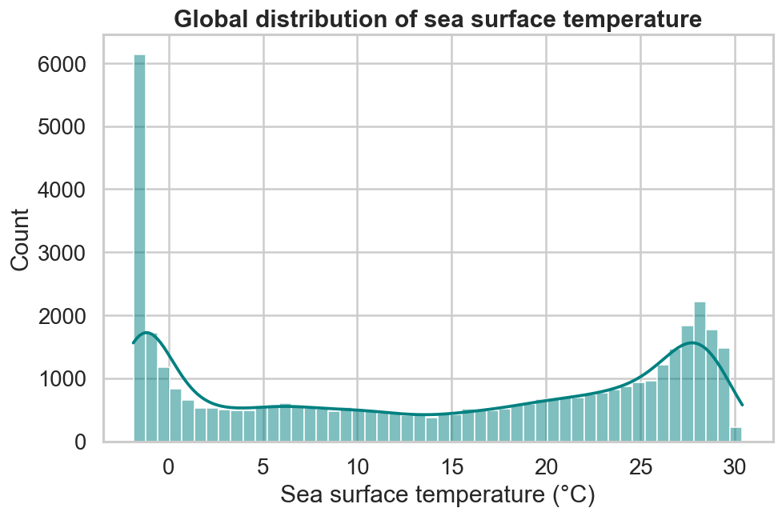
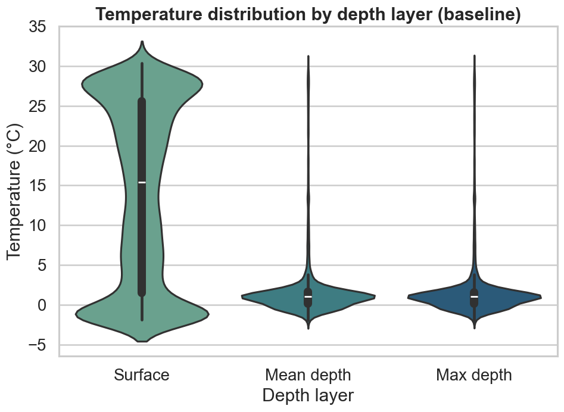

# Distributions & gradients

Maps show *where*; distributions show *how much*. These examples lean on the
**pandas** plotting API and [seaborn](https://seaborn.pydata.org/), which both
accept the tabular form returned by [`load_layer`][pyo_oracle.load_layer].

```bash
pip install "pyo-oracle[viz]"
```

We reuse the coarse global loader from the other pages and pull the `min`,
`mean` and `max` summaries in one request:

```python
ds = load_global("thetao_baseline_2000_2019_depthsurf", ["thetao_min", "thetao_mean", "thetao_max"])
```

## Latitudinal temperature gradient

Average over longitude to collapse the map into a single curve of temperature
against latitude, with the min–max range as a shaded band.

```python
import matplotlib.pyplot as plt

zonal = ds.mean(dim="longitude").isel(time=0)
lat = zonal["latitude"].values

fig, ax = plt.subplots(figsize=(8, 7))
ax.fill_betweenx(lat, zonal["thetao_min"], zonal["thetao_max"], color="tab:blue", alpha=0.2, label="min–max range")
ax.plot(zonal["thetao_mean"], lat, color="tab:red", lw=2.5, label="mean")
ax.set(xlabel="Sea surface temperature (°C)", ylabel="Latitude (°)")
ax.legend()
```



## Distribution of sea surface temperature

Convert a `DataArray` to a `DataFrame` with `.to_dataframe()` and the whole
pandas/seaborn toolkit opens up. The global histogram is bimodal — cold polar
water and a warm tropical band.

```python
import seaborn as sns

df = ds["thetao_mean"].isel(time=0).to_dataframe().dropna()
sns.histplot(df["thetao_mean"], bins=50, kde=True, color="teal")
```



## Temperature by depth layer

Bio-ORACLE provides the same variable summarised at the surface, mean depth and
maximum depth. Load each, tag it, concatenate, and compare with a violin plot.

```python
import pandas as pd

depths = {
    "Surface": "thetao_baseline_2000_2019_depthsurf",
    "Mean depth": "thetao_baseline_2000_2019_depthmean",
    "Max depth": "thetao_baseline_2000_2019_depthmax",
}
frames = []
for label, dsid in depths.items():
    sub = load_global(dsid, ["thetao_mean"])["thetao_mean"].isel(time=0).to_dataframe().dropna()[["thetao_mean"]]
    sub["Depth layer"] = label
    frames.append(sub)
long = pd.concat(frames, ignore_index=True)

sns.violinplot(data=long, x="Depth layer", y="thetao_mean", hue="Depth layer", palette="crest", legend=False)
```



!!! tip "Tabular by default"
    `load_layer` returns a `pandas.DataFrame` unless you pass `fmt="xarray"`, so
    you can skip the `.to_dataframe()` step when you only need the table.
