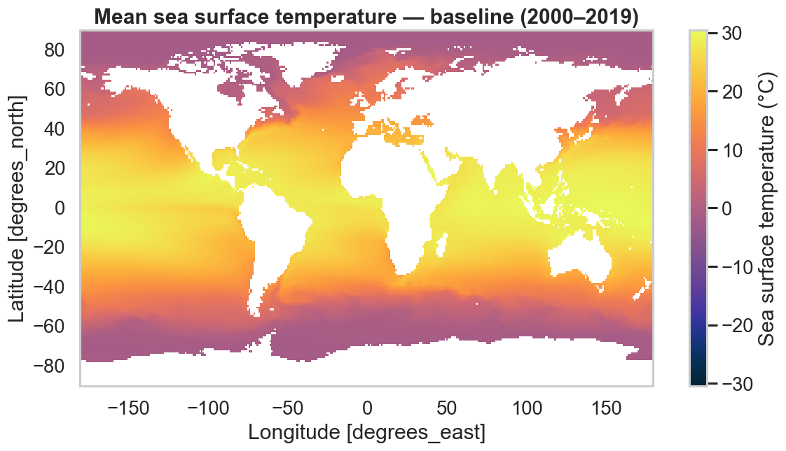
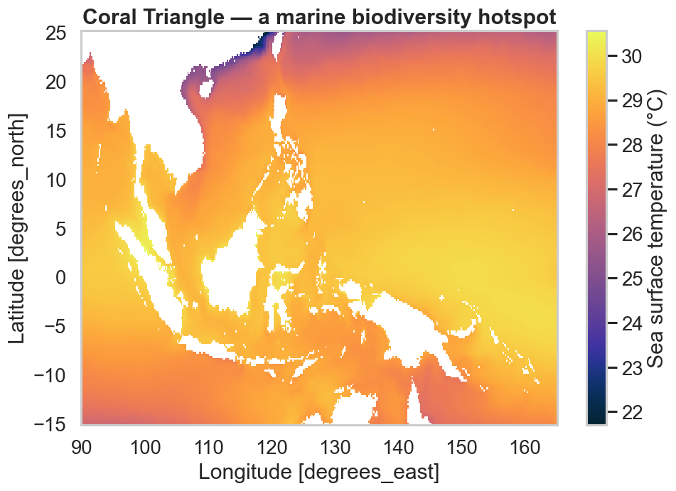

# Global maps & projections

Gridded layers loaded with [`load_layer`][pyo_oracle.load_layer]
(`fmt="xarray"`) plot in a single line. The examples below use the plotting
extra:

```bash
pip install "pyo-oracle[viz]"
```

## A coarse global subset

The native grid is 0.05°, so for a global view we stride over it with
`latitude_step` / `longitude_step` to keep the download small.

```python
import pyo_oracle as pyo

ds_id = "thetao_baseline_2000_2019_depthsurf"
constraints = pyo.build_constraints(
    ds_id,
    latitude=(-89.975, 89.975),
    longitude=(-179.975, 179.975),
    latitude_step=20,   # ~1° grid
    longitude_step=20,
)
ds = pyo.load_layer(ds_id, constraints=constraints, variables=["thetao_mean"], fmt="xarray")
```

## Quick map

`xarray`'s `.plot()` picks a sensible 2-D map automatically. Swap in a
[cmocean](https://matplotlib.org/cmocean/) colormap for an oceanographic look.

```python
import cmocean
import matplotlib.pyplot as plt

ds["thetao_mean"].isel(time=0).plot(
    figsize=(11, 5.5),
    cmap=cmocean.cm.thermal,
    cbar_kwargs={"label": "Sea surface temperature (°C)"},
)
plt.title("Mean sea surface temperature — baseline (2000–2019)")
```



## Publication-quality projection

For coastlines and a proper map projection, hand the same `DataArray` to a
[cartopy](https://scitools.org.uk/cartopy/) axis. The key is
`transform=ccrs.PlateCarree()` — it tells cartopy the data is on a regular
lon/lat grid.

```python
import cartopy.crs as ccrs

ax = plt.axes(projection=ccrs.Robinson())
ds["thetao_mean"].isel(time=0).plot(
    ax=ax,
    transform=ccrs.PlateCarree(),
    cmap=cmocean.cm.thermal,
    cbar_kwargs={"label": "Sea surface temperature (°C)", "shrink": 0.7},
)
ax.coastlines(linewidth=0.4)
ax.set_global()
```


## Zoom into a region

Pass tighter bounds with a finer step to study a single area — here the Coral
Triangle, the planet's richest marine biodiversity hotspot.

```python
constraints = pyo.build_constraints(
    ds_id,
    latitude=(-15, 25),
    longitude=(90, 165),
    latitude_step=4,    # ~0.2° grid
    longitude_step=4,
)
region = pyo.load_layer(ds_id, constraints=constraints, variables=["thetao_mean"], fmt="xarray")
region["thetao_mean"].isel(time=0).plot.pcolormesh(figsize=(9, 6), cmap=cmocean.cm.thermal)
```



!!! tip "Resolution vs. download size"
    Smaller `*_step` values mean finer maps but larger requests. Start coarse
    while exploring, then refine the step (or the bounding box) for the final
    figure.
