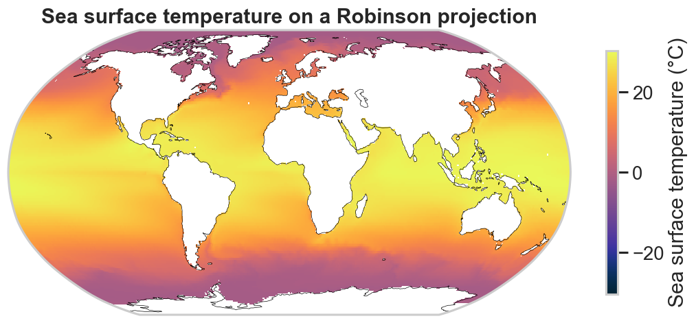

# Gallery

A tour of what Bio-ORACLE data looks like once it lands in Python. Every figure
below is built straight from [`load_layer`][pyo_oracle.load_layer] using the
**xarray** and **pandas** plotting APIs, with [cmocean](https://matplotlib.org/cmocean/)
colormaps and [cartopy](https://scitools.org.uk/cartopy/) projections.

!!! note "Reproducible"
    Install the plotting extra and every figure here can be regenerated:

    ```bash
    pip install "pyo-oracle[viz]"
    ```

    The exact code that produced these images lives in
    [`docs/gallery/generate_images.py`](https://github.com/bio-oracle/pyo_oracle/blob/main/docs/gallery/generate_images.py).

<div class="grid cards" markdown>

-   __Global maps & projections__

    ---

    [](global-maps.md)

    World temperature maps with oceanographic colormaps, a Robinson projection
    and coastlines, and a regional zoom.

-   __Climate change__

    ---

    [](climate-change.md)

    Warming maps, faceted SSP scenarios, and 2020–2090 projection trends.

-   __Distributions & gradients__

    ---

    [](distributions.md)

    Latitudinal temperature gradients, distributions, and a depth-layer
    comparison with the pandas plotting API.

-   __Multi-variable relationships__

    ---

    [](multivariable.md)

    Join temperature, oxygen, pH and salinity into one frame and explore how
    they covary.

</div>
