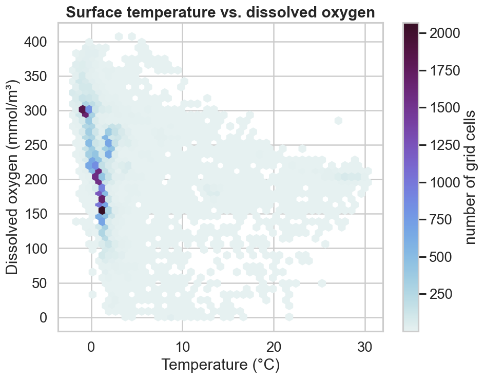
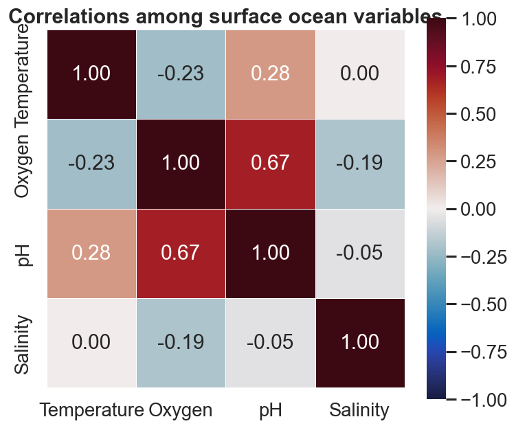

# Multi-variable relationships

The real power of Bio-ORACLE is combining layers. Because every variable sits on
the same grid, you can merge temperature, oxygen, pH and salinity into one table
and study how they covary — the backbone of marine niche and species
distribution modelling.

```bash
pip install "pyo-oracle[viz]"
```

!!! note "Watch the baseline years"
    Baseline periods differ per variable (`thetao`/`so` cover 2000–2019,
    `o2`/`ph` cover 2000–2018), so the dataset ids are not interchangeable.

## Merge several layers

Load each `*_mean` variable on the same coarse global grid, drop the (single)
time coordinate, and merge into one `xarray.Dataset`, then flatten to a frame.

```python
import xarray as xr

baseline_vars = {
    "thetao": ("thetao_baseline_2000_2019_depthmean", "thetao_mean"),
    "o2":     ("o2_baseline_2000_2018_depthmean", "o2_mean"),
    "ph":     ("ph_baseline_2000_2018_depthmean", "ph_mean"),
    "so":     ("so_baseline_2000_2019_depthmean", "so_mean"),
}

merged = None
for var, (dsid, col) in baseline_vars.items():
    da = load_global(dsid, [col])[col].isel(time=0, drop=True).rename(var)
    merged = da if merged is None else xr.merge([merged, da])

df = merged.to_dataframe().dropna().reset_index()
```

## Temperature vs. dissolved oxygen

A hexbin keeps a dense scatter readable. Cold water holds more oxygen, so the
cloud tilts down to the right.

```python
import cmocean
import matplotlib.pyplot as plt

fig, ax = plt.subplots(figsize=(8.5, 6.5))
hb = ax.hexbin(df["thetao"], df["o2"], gridsize=45, cmap=cmocean.cm.dense, mincnt=1)
fig.colorbar(hb, ax=ax, label="number of grid cells")
ax.set(xlabel="Temperature (°C)", ylabel="Dissolved oxygen (mmol/m³)")
```



## Correlation heatmap

`DataFrame.corr()` plus a seaborn heatmap summarises every pairwise
relationship at a glance.

```python
import seaborn as sns

corr = df[["thetao", "o2", "ph", "so"]].rename(
    columns={"thetao": "Temperature", "o2": "Oxygen", "ph": "pH", "so": "Salinity"}
).corr()

sns.heatmap(corr, annot=True, fmt=".2f", cmap=cmocean.cm.balance, vmin=-1, vmax=1, square=True)
```



!!! tip "From here to a model"
    This merged frame is exactly the predictor matrix a species distribution
    model expects. Join it to occurrence records on `latitude` / `longitude` and
    you have a training set.
